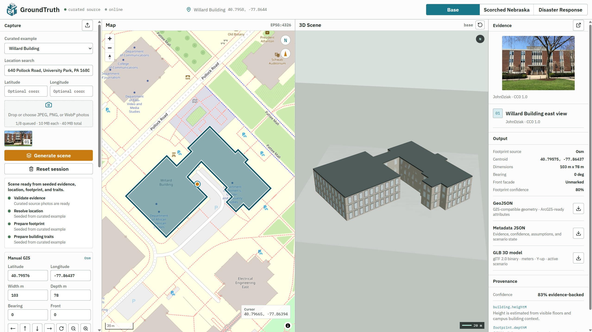
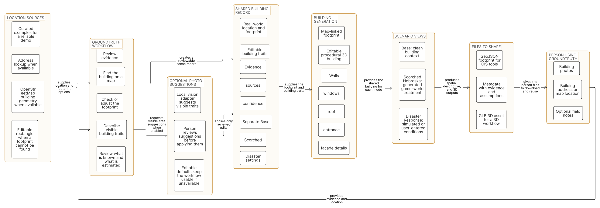

<p align="center">
  
</p>

<h1 align="center">GroundTruth</h1>

<p align="center">Turn building evidence into a reviewable, map-aligned 3D scene.</p>

<p align="center">
  
</p>

## The problem

People responding to a damaged, abandoned, or changing place need more than a folder of photos and a location pin. They need a shared view that connects evidence, map geometry, building traits, uncertainty, and a usable 3D representation.

GroundTruth is a browser-based workflow for creating that view. It accepts building photos and a location, uses an OpenStreetMap footprint when one is available, gives the user manual correction controls, and produces a scene that can be inspected in Base, Scorched Nebraska, or Disaster Response modes.

The application does not claim that its procedural model is a survey, photogrammetric reconstruction, or structural-safety assessment. Evidence-backed, inferred, assumed, manually edited, and simulated information remain labeled separately.

## Workflow

<p align="center">
  
</p>

1. Add one or more JPEG, PNG, or WebP photos and search for a building or enter an address.
2. Resolve a location and retrieve a canonical OpenStreetMap footprint where available.
3. Review and correct the location, footprint dimensions, bearing, facade direction, and building traits.
4. Inspect the footprint-aligned procedural building in the 3D workspace.
5. Explore simulated Scorched Nebraska or Disaster Response treatments without overwriting the Base record.
6. Export the active scene as GeoJSON, metadata JSON, or GLB.

## What it includes

- Curated Burruss Hall and Willard Building examples with attributed evidence photos.
- Custom evidence uploads kept in the current browser session.
- Address search with ranked geocoding results and a map view built with MapLibre and OpenStreetMap data.
- OSM-first footprint and height enrichment with a clear manual-rectangle fallback.
- Manual placement, nudge, rotate, scale, and photo-facing facade controls.
- Editable building traits for height, floors, material, roof, windows, entrance placement, facade color, and visible modules.
- A Three.js and React Three Fiber viewport that extrudes the authoritative footprint instead of trusting a single-photo mesh.
- Procedural base detail including window frames, parapets, entrances, facade modules, roof treatments, and a Burruss-specific Hokie Stone treatment.
- Scorched Nebraska controls for decay, scorch, vegetation, boarded windows, and debris.
- Simulated Fire, Flood, Wind, and Structural disaster treatments with severity controls, hazard metadata, and access status.
- A focused evidence viewer, provenance, confidence, assumptions, and scenario labels.
- GeoJSON, metadata JSON, and GLB export for the active scene.

## Architecture

The React client owns the editing workspace and shared scene state. A small Express API provides curated scene records, geocoding and footprint adapters, and conservative trait suggestions. Shared Zod schemas keep project data and exports consistent.

```text
Photos + address
        |
        v
Geocoding and OSM footprint lookup
        |
        v
Reviewed canonical scene record
        |
        +--> MapLibre map and footprint correction tools
        |
        +--> React Three Fiber procedural scene
        |
        +--> GeoJSON, metadata JSON, and GLB exports
```

The scene uses the map footprint as the authoritative ground plan when one exists. Photo-derived traits supplement the facade treatment. When no trustworthy footprint is available, GroundTruth creates an editable rectangle and marks that limitation.

## Local development

Requirements:

- Node.js 24 or newer
- npm 11 or newer

```bash
npm install
npm run dev
```

The Vite client normally starts at `http://localhost:5173`. If that port is already in use, Vite selects another available port. The Express API runs at `http://localhost:8787`.

## Validation

```bash
npm run typecheck
npm run lint
npm test
npm run build
npm run test:e2e
```

The project includes unit, component, API, export, responsive-layout, and browser visual-regression coverage.

## Configuration

Copy `.env.example` to `.env` only when you need optional integrations.

| Setting | Purpose |
| --- | --- |
| `GROUNDTRUTH_ENABLE_LIVE_GIS` | Enables live Nominatim and Overpass lookups. Keep this disabled for deterministic offline demos. |
| `GROUNDTRUTH_NOMINATIM_URL` | Optional Nominatim-compatible geocoding endpoint. |
| `GROUNDTRUTH_OVERPASS_URL` | Optional Overpass-compatible footprint endpoint. |
| `GROUNDTRUTH_GIS_USER_AGENT` | Identifying user agent for live GIS requests. |
| `VITE_MAP_STYLE_URL` | Optional MapLibre style override. |
| `VISION_ADAPTER_URL=mock` | Exercises deterministic visible-facade suggestions without calling a model service. |

Live GIS requests use conservative timeouts, caching, attribution, and a manual fallback. Production deployments should use providers and limits appropriate for their expected traffic.

## Current limitations

- A single photo cannot reliably recover hidden facade geometry, depth, roof topology, or exact opening placement.
- Procedural facade modules and scenario damage are illustrative and editable. They are not observed damage records or engineering findings.
- Google Earth and Street View imagery are not imported as building textures. A future integration would need a permitted imagery source and license review.
- Gaussian splatting requires overlapping photos or video plus a separate reconstruction pipeline. It is not generated from a single uploaded photo.
- OSM footprint and height data are community-maintained sources and should be reviewed for operational use.

## Built with

React, TypeScript, Vite, Express, Zod, Zustand, MapLibre, OpenStreetMap, Three.js, React Three Fiber, Vitest, and Playwright.

## Future Ideas (gotten from the judging demo)
- Adding a way to scrape data for internal building layouts, so that for emergency responders, they can also see not just how the building looks like from the outside, but also how the interactions and layouts internally look and relate to each other.
  - Perhaps this could be done by scraping from public building data, and maybe layouts from places like Zillow, but I'll need to check if that's allowed in the first place.
  - Overall, this could be really helpful for responders to quickly figure out how the building is built and how it interacts with the surrounding environment, even simulating earthquakes, floods, fires, and other disasters.

## License and attribution

See [LICENSE](LICENSE). Curated evidence photos retain their original attribution and license information in the application. OpenStreetMap data is displayed with required attribution.
